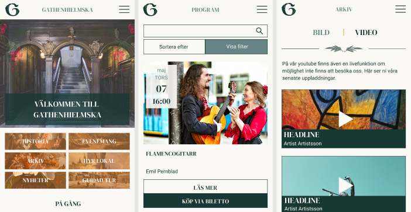

# Gathenhielmska Huset

## About This Project
This is a group project completed by a team of Digital Designers and Web Developers from Yrgo. It is a mobile website for the Gathenhielmska Culture Centre at Stigbergstorget, Gothenburg.

The website is built into a WordPlate configured WordPress CMS, and is written with HTML, CSS (SASS), JavaScript (vanilla) and PHP. 

## Plugins and Libraries Used
* ACF Pro (WordPress)
* ACF to Rest API (WordPress)
* Smash Balloon Instagram Feed (WordPress)
* Smash Balloon Youtube Feed (WordPress)
* Soil (WordPress)
* PHPMailer 

## Installation
* Clone the repository using `https://github.com/AltDom/gathenhielmska.git` in your chosen bash terminal.
* Enter the project folder using the command `cd gathenhielmska/`.
* View the project codes in your default editor using the command `code .`.
* Download and install Composer. Use the command `composer install` to install the required project files to the vendor directory.
* Download and install NPM. Use the command `npm run build` followed by `npm start` to run the project's starting script.
* In a new terminal tab, enter the project public folder using the command `cd public/`.
* Create a local server using the command `php -S localhost:8000`.
* Open your browser of choice (e.g. Brave) and go to the url `localhost:8000`.

## Building the WordPress Database
* In a second browser window, got to the url `localhost:8000/wordpress/wd-admin/` to view the CMS.
* Download the 5 WordPress plugins listed above and ensure they are located in the `public/plugins` directory. Back on the CMS page, activate them all by clicking the Plugins tab on the left nav bar and clicking on `activate` for each.
* Create the website's pages in the Pages tab. The pages to include are: Archive, Email, Events, Guided Tour, Home, History, Hire Venue, News and Contact. In each created page, ensure that the permalink slug is exactly the same name as written here, in lowercase and hyphenated where two words exists (e.g. guided-tour). The home page should have its permalink set to your localhost (e.g. `http://localhost:8000/`). Also choose the Template that matches each page name, however leave the Archive page as the `Default template`.
* To build the Instagram and YouTube feeds, connect to existing Instagram and Youtube accounts in their respective tabs, and paste the lines `[instagram-feed user="YOUR-ACCOUNT-NAME"]` and `[youtube-feed width="300px"]` into their respective page bodies.
* Populate the website by loading in content via the tabs named Posts (for news articles), Events, Staff, Affiliations, Venues, Tours and History.
* In the `Appearance/Menus` tab, create a menu which includes Home, Events, Guided Tour, Hire Venue, Archive, News, Contact and History. Ensure the Display Location checkedbox is checked for "Navigation".

## Experience the website
* Head back to your first browser window (`http://localhost:8000`) and the site should be "live" in your locally hosted browser.
* In order to experience submitting the forms (mailing list, hire venue or group booking) using the PHPMailer code library, you will need to configure a `Gmail` email account to host this service for you. Your chosen Gmail email address will need to have `2-Step Verification` disabled and `Less Secure Apps` enabled. In the email.php file, populate the three empty string fields with the account's username (without "@gmail.com") and password, and also include a `$to` email address. The website forms should then send emails to your chosen "to" address from your chosen Gmail address.

## Designers and Developers
* Oskar Joss - Web Developer
* Dominic Kersch - Web Developer
* Frida Aagaard - Digital Design
* Anton Henricson - Digital Design
